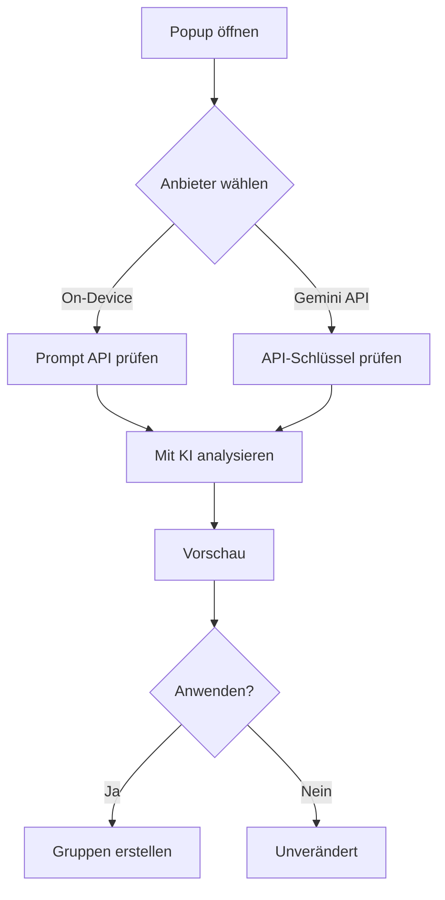

<div align="center">

# Tab Cluster AI

**Chrome-Tabs automatisch mit On-Device-KI oder Gemini API gruppieren**

<p>
  
  
  
  <a href="LICENSE"></a>
</p>

| English | 日本語 | Deutsch | Español | Français |
| :---: | :---: | :---: | :---: | :---: |
| [README.md](README.md) | [README.ja.md](README.ja.md) | **Hier** | [README.es.md](README.es.md) | [README.fr.md](README.fr.md) |

[Schnellstart](#schnellstart) · [Installation](#installation) · [Nutzung](#nutzung) · [FAQ](#faq) · [Entwicklung](#entwicklung)

<sub>Offene Alternative zum eingestellten Tab Organizer — Vorschläge prüfen, dann anwenden.</sub>

</div>

---

## Inhaltsverzeichnis

- [Überblick](#überblick)
- [Funktionen](#funktionen)
- [Ablauf](#ablauf)
- [Analysemodi](#analysemodi)
- [Voraussetzungen](#voraussetzungen)
- [Erster Modell-Download](#erster-modell-download)
- [Schnellstart](#schnellstart)
- [Installation](#installation)
- [Nutzung](#nutzung)
- [Grenzen](#grenzen)
- [Fehlerbehebung](#fehlerbehebung)
- [FAQ](#faq)
- [Entwicklung](#entwicklung)
- [Datenschutz](#datenschutz)
- [Lizenz](#lizenz)

---

## Überblick

| | **On-Device-KI** | **Gemini API** |
| --- | --- | --- |
| **Ideal für** | Datenschutz, kein API-Schlüssel | Schneller Einstieg, schwächere Hardware |
| **API-Schlüssel** | Nicht nötig | Erforderlich ([AI Studio](https://aistudio.google.com/apikey)) |
| **Daten verlassen Gerät** | Nein (Verarbeitung in Chrome) | Ja (Titel + URLs an Google) |
| **22 GB Modell-Download** | Beim ersten Analyse-Lauf | Nein |
| **Chrome-Version** | 138+ mit Prompt API | Aktuelles MV3-Chrome |
| **Tabs pro Lauf** | 40 | 40 |

> **Tipp:** Bei `unavailable` in der Diagnose zuerst **Gemini API** testen. Später auf On-Device für rein lokale Verarbeitung wechseln.

---

## Funktionen

| Funktion | Beschreibung |
| --- | --- |
| **On-Device-KI** | Semantische Gruppierung mit Gemini Nano (Prompt API) |
| **Gemini API** | Cloud-Analyse mit wählbarem Modell |
| **Prüfen vor Anwenden** | Vorschau — Tabs ändern sich erst nach Bestätigung |
| **Nach Domain** | **Nach Domain sortieren** ohne KI |
| **Bestehende Gruppen** | Vorschläge können in vorhandene Gruppen integriert werden |
| **Eigene Wünsche** | Optionale Freitext-Präferenzen (lokal gespeichert) |
| **Diagnose** | Hardware, Prompt API, wahrscheinliche Blocker |
| **Mehrsprachige UI** | EN / JA / DE / ES / FR — folgt Chrome-UI-Sprache |

> **Hinweis:** **Gruppennamen** folgen `navigator.languages`. Die **Oberfläche** folgt der Chrome-UI-Sprache via `_locales/`.

---

## Ablauf



---

## Analysemodi

### On-Device (Gemini Nano)

[Prompt API](https://developer.chrome.com/docs/ai/prompt-api) — Verarbeitung lokal nach Modell-Download.

> **Warnung:** **On-Device-KI** in den Einstellungen zu aktivieren lädt das Modell **nicht**. Der ~22-GB-Download startet beim ersten **Mit KI analysieren**.

### Gemini API

Google Generative Language API. Sinnvoll, wenn Prompt API blockiert ist.

> **Wichtig:** Tab-Titel und URLs werden an Google gesendet. API-Schlüssel nur in `chrome.storage.local`.

### Regelbasiert

**Nach Domain sortieren** — kein Modell, kein Schlüssel. Mindestens 2 Tabs pro Domain.

---

## Voraussetzungen

### On-Device-KI

| Punkt | Anforderung | Anmerkung |
| --- | --- | --- |
| Browser | Chrome **138+** | |
| OS | macOS 13+ / Win 10+ / Linux | |
| RAM | **16 GB+** oder **4 GB+** VRAM | Referenzwerte in Diagnose |
| Speicher | **22 GB+** frei | Erster Download |
| Netzwerk | Unbegrenzt (WLAN) | Beim ersten Download |
| Einstellung | On-Device-KI **AN** | Einstellungen → System |

### Gemini API

| Punkt | Anforderung |
| --- | --- |
| Browser | MV3-Chrome |
| Schlüssel | [AI Studio](https://aistudio.google.com/apikey) |
| Netzwerk | `generativelanguage.googleapis.com` |

---

## Erster Modell-Download

Nur **On-Device-Modus**.

| Phase | Ablauf | Anzeige |
| --- | --- | --- |
| 1 | Erstes Analysieren | Bereitschaft prüfen |
| 2 | ~22 GB Download | Prozent + Bytes |
| 3 | Hintergrund-DL | Verstrichene Zeit |
| 4 | Laden in RAM | „Modell wird geladen…“ |
| 5 | Cache | Kein erneuter Download |

> **Tipp:** Popup beim ersten Lauf **geöffnet lassen** für Fortschrittsanzeige.

---

## Schnellstart

```
1. Erweiterung laden (siehe Installation)
2. Symbol in der Symbolleiste klicken
3. On-Device oder Gemini API + Schlüssel
4. Mindestens 2 nicht gruppierte Tabs
5. „Mit KI analysieren“
6. Vorschau → „Gruppen anwenden“
```

---

## Installation

| Schritt | Aktion |
| ---: | --- |
| 1 | ZIP von [Releases](https://github.com/0xmokuren/TabClusterAI/releases/latest) |
| 2 | Entpacken |
| 3 | `chrome://extensions` |
| 4 | **Entwicklermodus** |
| 5 | **Entpackte Erweiterung laden** |

```bash
git clone https://github.com/0xmokuren/TabClusterAI.git && cd TabClusterAI
npm install && npm run check && npm run build
```

---

## Nutzung

| Schritt | Aktion |
| ---: | --- |
| 1 | Popup öffnen |
| 2 | Anbieter wählen |
| 3 | Optional Präferenzen eingeben |
| 4 | **Mit KI analysieren** (≥ 2 Tabs) |
| 5 | Vorschau prüfen |
| 6 | **Gruppen anwenden** |

**Modelle:** `gemini-3.1-flash-lite` (Standard), `gemini-3.5-flash`, `gemini-2.5-*`, `gemini-3-flash-preview` — siehe `lib/gemini-models.js`.

> **Hinweis:** **404** → anderes `stable`-Modell wählen. **429** → Rate-Limit, warten.

---

## Grenzen

| Grenze | Wert |
| --- | --- |
| Tabs pro Lauf | **40** |
| Minimum | **2** Tabs |
| Angeheftet / `chrome://` | Ausgeschlossen |
| Gruppenname | max. **20** Zeichen |

---

## Fehlerbehebung

| Symptom | Lösung |
| --- | --- |
| `unavailable` | Diagnose + Flags prüfen |
| Leere Vorschau | Mehr Tabs oder Domain-Sortierung |
| 403 | API-Schlüssel neu erstellen |

**Checkliste:** `optimization-guide-on-device-model` Enabled · `prompt-api-for-gemini-nano` Enabled multilingual · `on-device-internals` → Model Status · Chrome neu starten

---

## FAQ

<details>
<summary><strong>Ersatz für Tab Organizer?</strong></summary>

Ja — semantische Gruppierung mit Vorschau, plus Gemini API und Domain-Fallback.
</details>

<details>
<summary><strong>Zwei Sprachsysteme?</strong></summary>

UI = Chrome-Sprache (`_locales/`). Gruppennamen = `navigator.languages` (`locale.js`).
</details>

<details>
<summary><strong>Ohne KI nutzbar?</strong></summary>

Ja — **Nach Domain sortieren**.
</details>

---

## Entwicklung

```bash
npm run check    # validate + lint + locale keys
npm run build    # ZIP mit _locales/
```

---

## Datenschutz

| Modus | Daten | Ziel |
| --- | --- | --- |
| On-Device | Titel + URL | Chrome intern |
| Gemini API | Titel + URL | Google API |
| Domain | Hostname | Keine Übertragung |

Kein Analytics-SDK. Quellcode offen.

---

## Lizenz

[MIT License](LICENSE)

---

<div align="center">

<sub>Tab Cluster AI v1.5.2 · <a href="https://github.com/0xmokuren/TabClusterAI/issues">Issue melden</a> · <a href="README.md">English</a></sub>

</div>
