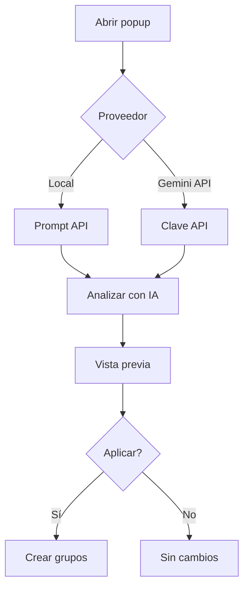

<div align="center">

# Tab Cluster AI

**Agrupa pestañas de Chrome con IA local o la API de Gemini**

<p>
  
  
  
  <a href="LICENSE"></a>
  <a href="https://github.com/sponsors/0xmokuren"></a>
</p>

| English | 日本語 | Deutsch | Español | Français |
| :---: | :---: | :---: | :---: | :---: |
| [README.md](README.md) | [README.ja.md](README.ja.md) | [README.de.md](README.de.md) | **Aquí** | [README.fr.md](README.fr.md) |

[Inicio rápido](#inicio-rápido) · [Instalación](#instalación) · [Uso](#uso) · [FAQ](#faq) · [Desarrollo](#desarrollo)

<sub>Alternativa abierta a Tab Organizer de Google — revisa las sugerencias antes de aplicar.</sub>

</div>

---

## Índice

- [Resumen](#resumen)
- [Características](#características)
- [Flujo](#flujo)
- [Modos de análisis](#modos-de-análisis)
- [Requisitos](#requisitos)
- [Primera descarga del modelo](#primera-descarga-del-modelo)
- [Inicio rápido](#inicio-rápido)
- [Instalación](#instalación)
- [Uso](#uso)
- [Límites](#límites)
- [Solución de problemas](#solución-de-problemas)
- [FAQ](#faq)
- [Desarrollo](#desarrollo)
- [Privacidad](#privacidad)
- [Licencia](#licencia)

---

## Resumen

| | **IA en dispositivo** | **Gemini API** |
| --- | --- | --- |
| **Ideal para** | Privacidad, sin clave API | Inicio rápido, hardware limitado |
| **Clave API** | No | Sí ([AI Studio](https://aistudio.google.com/apikey)) |
| **Datos salen del dispositivo** | No | Sí (títulos + URL a Google) |
| **Descarga ~22 GB** | Primera análisis | No |
| **Chrome** | 138+ con Prompt API | MV3 reciente |
| **Pestañas por ejecución** | 40 | 40 |

> **Consejo:** Si aparece `unavailable` en Diagnóstico, prueba primero **Gemini API**.

---

## Características

| Función | Descripción |
| --- | --- |
| **IA local** | Agrupación semántica con Gemini Nano (Prompt API) |
| **Gemini API** | Análisis en la nube con modelo elegible |
| **Revisar antes** | Vista previa obligatoria antes de aplicar |
| **Por dominio** | Sin IA — agrupa por hostname |
| **Fusionar grupos** | Integra con grupos existentes |
| **Preferencias** | Texto libre guardado localmente |
| **Diagnóstico** | Hardware, Prompt API, causas probables |
| **UI multilingüe** | EN / JA / DE / ES / FR |

> **Nota:** Nombres de grupo → `navigator.languages`. Interfaz → idioma UI de Chrome (`_locales/`).

---

## Flujo



---

## Modos de análisis

### En el dispositivo

[Prompt API](https://developer.chrome.com/docs/ai/prompt-api) — procesamiento local tras la descarga.

> **Advertencia:** Activar IA en el dispositivo **no** instala el modelo. La descarga de ~22 GB empieza en el primer **Analizar con IA**.

### Gemini API

Envía títulos y URL a Google. Clave solo en `chrome.storage.local`.

### Por dominio

Sin modelo ni clave. Mínimo 2 pestañas por dominio.

---

## Requisitos

### IA en dispositivo

| Elemento | Requisito | Notas |
| --- | --- | --- |
| Navegador | Chrome **138+** | |
| RAM | **16 GB+** o **4 GB+** VRAM | Valores de referencia |
| Almacenamiento | **22 GB+** libres | |
| Red | Sin límite de datos | Primera descarga |
| Ajuste | IA en dispositivo **ON** | Ajustes → Sistema |

### Gemini API

Clave en [AI Studio](https://aistudio.google.com/apikey) y acceso a `generativelanguage.googleapis.com`.

---

## Primera descarga del modelo

Solo modo **en dispositivo**.

| Fase | Qué ocurre |
| --- | --- |
| 1 | Primer análisis dispara la descarga |
| 2 | ~22 GB con porcentaje en UI |
| 3 | Posible DL en segundo plano |
| 4 | Carga en memoria |
| 5 | Caché local en siguientes usos |

> **Consejo:** Mantén el popup **abierto** en la primera ejecución.

---

## Inicio rápido

```
1. Cargar extensión
2. Icono en barra de herramientas
3. On-device o Gemini API + clave
4. ≥ 2 pestañas sin agrupar
5. Analizar con IA
6. Vista previa → Aplicar grupos
```

---

## Instalación

| Paso | Acción |
| ---: | --- |
| 1 | [Releases](https://github.com/0xmokuren/TabClusterAI/releases/latest) |
| 2 | Extraer ZIP |
| 3 | `chrome://extensions` |
| 4 | **Modo desarrollador** |
| 5 | **Cargar descomprimida** |

```bash
npm install && npm run check && npm run build
```

---

## Uso

Modelos en `lib/gemini-models.js` — predeterminado `gemini-3.1-flash-lite`.

> **404** → cambiar modelo `stable`. **429** → esperar o revisar cuota en AI Studio.

---

## Límites

| Límite | Valor |
| --- | --- |
| Pestañas / ejecución | **40** |
| Mínimo | **2** |
| Fijadas / `chrome://` | Excluidas |
| Nombre de grupo | **20** caracteres |

---

## Solución de problemas

| Síntoma | Acción |
| --- | --- |
| `unavailable` | Abrir Diagnóstico |
| Vista previa vacía | Más pestañas o por dominio |
| Clave inválida | Regenerar en AI Studio |

Flags: `optimization-guide-on-device-model` · `prompt-api-for-gemini-nano` · reiniciar Chrome.

---

## FAQ

<details>
<summary><strong>¿Sustituto de Tab Organizer?</strong></summary>

Sí, con vista previa, Gemini API y agrupación por dominio.
</details>

<details>
<summary><strong>¿Dos sistemas de idioma?</strong></summary>

UI = Chrome. Nombres de grupo = idioma del navegador para contenido.
</details>

<details>
<summary><strong>¿Sin IA?</strong></summary>

Sí — **Organizar por dominio**.
</details>

---

## Desarrollo

```bash
npm run check    # validate + lint + claves _locales
npm run build    # ZIP con traducciones
```

---

## Privacidad

| Modo | Datos | Destino |
| --- | --- | --- |
| Local | Título + URL | Chrome |
| Gemini API | Título + URL | Google |
| Dominio | Hostname | Ninguno |

Sin SDK de analítica. Código abierto.

---

## Licencia

[MIT License](LICENSE)

---

<div align="center">

<sub>Tab Cluster AI v1.5.5 · <a href="https://github.com/0xmokuren/TabClusterAI/issues">Reportar issue</a> · <a href="README.md">English</a></sub>

</div>
