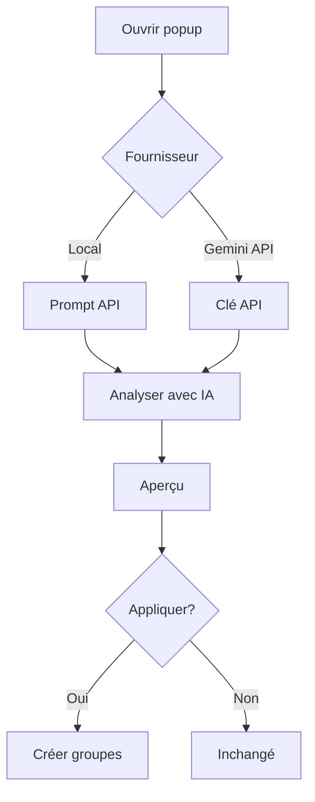

<div align="center">

# Tab Cluster AI

**Regroupez les onglets Chrome avec l'IA locale ou l'API Gemini**

<p>
  
  
  
  <a href="LICENSE"></a>
</p>

| English | 日本語 | Deutsch | Español | Français |
| :---: | :---: | :---: | :---: | :---: |
| [README.md](README.md) | [README.ja.md](README.ja.md) | [README.de.md](README.de.md) | [README.es.md](README.es.md) | **Ici** |

[Démarrage rapide](#démarrage-rapide) · [Installation](#installation) · [Utilisation](#utilisation) · [FAQ](#faq) · [Développement](#développement)

<sub>Alternative ouverte à Tab Organizer — vérifiez les suggestions avant d'appliquer.</sub>

</div>

---

## Sommaire

- [Vue d'ensemble](#vue-densemble)
- [Fonctionnalités](#fonctionnalités)
- [Déroulement](#déroulement)
- [Modes d'analyse](#modes-danalyse)
- [Prérequis](#prérequis)
- [Premier téléchargement](#premier-téléchargement)
- [Démarrage rapide](#démarrage-rapide)
- [Installation](#installation)
- [Utilisation](#utilisation)
- [Limites](#limites)
- [Dépannage](#dépannage)
- [FAQ](#faq)
- [Développement](#développement)
- [Confidentialité](#confidentialité)
- [Licence](#licence)

---

## Vue d'ensemble

| | **IA sur l'appareil** | **Gemini API** |
| --- | --- | --- |
| **Idéal pour** | Confidentialité, pas de clé | Démarrage rapide, matériel limité |
| **Clé API** | Non | Oui ([AI Studio](https://aistudio.google.com/apikey)) |
| **Données externes** | Non (traitement dans Chrome) | Oui (titres + URL vers Google) |
| **Téléchargement ~22 Go** | Première analyse | Non |
| **Chrome** | 138+ avec Prompt API | MV3 récent |
| **Onglets / exécution** | 40 | 40 |

> **Astuce :** En cas de `unavailable` dans Diagnostic, essayez d'abord **Gemini API**.

---

## Fonctionnalités

| Fonction | Description |
| --- | --- |
| **IA locale** | Regroupement sémantique via Gemini Nano (Prompt API) |
| **Gemini API** | Analyse cloud avec modèle au choix |
| **Vérifier avant** | Aperçu obligatoire avant application |
| **Par domaine** | Sans IA — regroupement par hostname |
| **Fusion** | Intégration aux groupes existants |
| **Préférences** | Texte libre enregistré localement |
| **Diagnostic** | Matériel, Prompt API, causes probables |
| **UI multilingue** | EN / JA / DE / ES / FR |

> **Note :** Noms de groupe → `navigator.languages`. Interface → langue UI Chrome (`_locales/`).

---

## Déroulement



---

## Modes d'analyse

### Sur l'appareil

[Prompt API](https://developer.chrome.com/docs/ai/prompt-api) — traitement local après téléchargement.

> **Attention :** Activer l'IA sur l'appareil **n'installe pas** le modèle. Le téléchargement ~22 Go commence au premier **Analyser avec l'IA**.

### Gemini API

Titres et URL envoyés à Google. Clé stockée dans `chrome.storage.local` uniquement.

### Par domaine

Sans modèle ni clé. Minimum 2 onglets par domaine.

---

## Prérequis

### IA sur l'appareil

| Élément | Exigence | Remarque |
| --- | --- | --- |
| Navigateur | Chrome **138+** | |
| Mémoire | **16 Go+** ou **4 Go+** VRAM | Valeurs indicatives |
| Stockage | **22 Go+** libres | |
| Réseau | Non limité | Premier téléchargement |
| Réglage | IA sur l'appareil **ON** | Paramètres → Système |

### Gemini API

Clé [AI Studio](https://aistudio.google.com/apikey) + accès à `generativelanguage.googleapis.com`.

---

## Premier téléchargement

Mode **sur l'appareil** uniquement.

| Phase | Événement |
| --- | --- |
| 1 | Première analyse déclenche le téléchargement |
| 2 | ~22 Go avec pourcentage |
| 3 | Téléchargement possible en arrière-plan |
| 4 | Chargement en mémoire |
| 5 | Cache local ensuite |

> **Astuce :** Gardez le popup **ouvert** lors de la première utilisation.

---

## Démarrage rapide

```
1. Charger l'extension
2. Icône barre d'outils
3. Sur l'appareil ou Gemini API + clé
4. ≥ 2 onglets non groupés
5. Analyser avec l'IA
6. Aperçu → Appliquer les groupes
```

---

## Installation

| Étape | Action |
| ---: | --- |
| 1 | [Releases](https://github.com/0xmokuren/TabClusterAI/releases/latest) |
| 2 | Extraire le ZIP |
| 3 | `chrome://extensions` |
| 4 | **Mode développeur** |
| 5 | **Charger l'extension non empaquetée** |

```bash
npm install && npm run check && npm run build
```

---

## Utilisation

Modèles dans `lib/gemini-models.js` — défaut `gemini-3.1-flash-lite`.

> **404** → autre modèle `stable`. **429** → limite de débit, patienter.

---

## Limites

| Limite | Valeur |
| --- | --- |
| Onglets / exécution | **40** |
| Minimum | **2** |
| Épinglés / `chrome://` | Exclus |
| Nom de groupe | **20** caractères |

---

## Dépannage

| Symptôme | Action |
| --- | --- |
| `unavailable` | Ouvrir Diagnostic |
| Aperçu vide | Plus d'onglets ou par domaine |
| Clé invalide | Régénérer sur AI Studio |

Flags : `optimization-guide-on-device-model` · `prompt-api-for-gemini-nano` · redémarrer Chrome.

---

## FAQ

<details>
<summary><strong>Remplacement de Tab Organizer ?</strong></summary>

Oui — regroupement sémantique avec aperçu, Gemini API et fallback par domaine.
</details>

<details>
<summary><strong>Deux systèmes de langue ?</strong></summary>

UI = Chrome. Noms de groupe = langues du navigateur pour le contenu.
</details>

<details>
<summary><strong>Sans IA ?</strong></summary>

Oui — **Organiser par domaine**.
</details>

---

## Développement

```bash
npm run check    # validate + lint + clés _locales
npm run build    # ZIP avec traductions
```

---

## Confidentialité

| Mode | Données | Destination |
| --- | --- | --- |
| Local | Titre + URL | Chrome |
| Gemini API | Titre + URL | Google |
| Domaine | Hostname | Aucune |

Pas de SDK analytique. Code source ouvert.

---

## Licence

[MIT License](LICENSE)

---

<div align="center">

<sub>Tab Cluster AI v1.5.4 · <a href="https://github.com/0xmokuren/TabClusterAI/issues">Signaler un problème</a> · <a href="README.md">English</a></sub>

</div>
