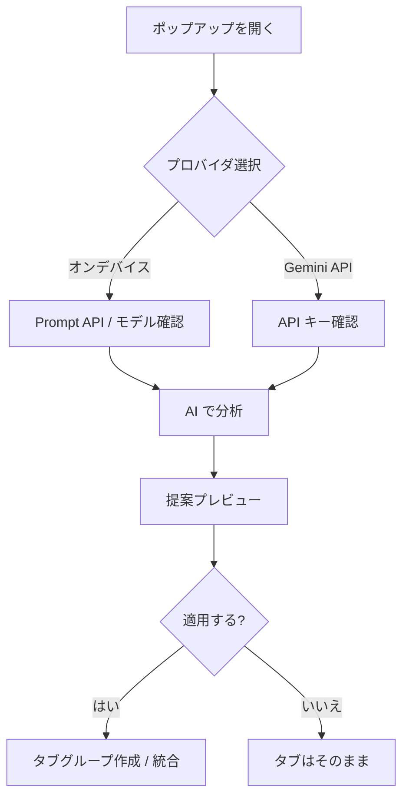

<div align="center">

# Tab Cluster AI

**Chrome のタブを、オンデバイス AI または Gemini API で自動グループ化**

<p>
  
  
  
  <a href="LICENSE"></a>
</p>

| English | 日本語 | Deutsch | Español | Français |
| :---: | :---: | :---: | :---: | :---: |
| [README.md](README.md) | **こちら** | [README.de.md](README.de.md) | [README.es.md](README.es.md) | [README.fr.md](README.fr.md) |

[クイックスタート](#クイックスタート) · [インストール](#インストール) · [使い方](#使い方) · [FAQ](#faq) · [開発](#開発)

<sub>Google が廃止した Tab Organizer のオープン代替。AI の提案を確認してから適用できます。</sub>

</div>

---

## 目次

- [概要一覧](#概要一覧)
- [特徴](#特徴)
- [動作の流れ](#動作の流れ)
- [分析モード](#分析モード)
- [必要条件](#必要条件)
- [初回モデルダウンロード](#初回モデルダウンロード)
- [クイックスタート](#クイックスタート)
- [インストール](#インストール)
- [使い方](#使い方)
- [制限](#制限)
- [トラブルシューティング](#トラブルシューティング)
- [FAQ](#faq)
- [開発](#開発)
- [プライバシー](#プライバシー)
- [ライセンス](#ライセンス)

---

## 概要一覧

| | **オンデバイス AI** | **Gemini API** |
| --- | --- | --- |
| **向いている用途** | プライバシー重視・API キー不要 | 手軽に始めたい・端末スペック不足 |
| **API キー** | 不要 | 必要（[AI Studio](https://aistudio.google.com/apikey)） |
| **外部送信** | なし（Chrome 内で処理） | あり（タイトル + URL を Google へ） |
| **22 GB モデル DL** | 初回分析時に必要 | 不要 |
| **Chrome バージョン** | Prompt API 対応の 138+ | MV3 対応版なら可 |
| **1 回の整理上限** | 40 タブ | 40 タブ |

> **ヒント:** 診断で `unavailable` と出る場合は、まず **Gemini API** で試すのが手早いです。のちにオンデバイスへ切り替えれば完全ローカル処理に移行できます。

---

## 特徴

| 機能 | 説明 |
| --- | --- |
| **オンデバイス AI** | Gemini Nano（Prompt API）で意味の近いタブをグループ化。API キー・クラウド送信不要 |
| **Gemini API** | Google AI Studio のキーでクラウド分析。複数モデルから選択可能 |
| **確認してから適用** | プレビューで提案を確認し、問題なければ適用。勝手にタブは動きません |
| **ドメイン整理** | **ドメインで整理** は AI なしでホスト名ごとにまとめられます |
| **既存グループへ統合** | 提案を既存のタブグループにマージ可能 |
| **グループ化の方針** | 任意の自由記述（例:「仕事と買い物を分ける」）をローカル保存 |
| **診断情報** | ハードウェア・Prompt API 状態・想定原因を一覧表示 |
| **多言語 UI** | 英語・日本語・ドイツ語・スペイン語・フランス語（Chrome UI 言語に追従） |

> **注:** グループ**名**の言語はブラウザのコンテンツ言語（`navigator.languages`）、**画面**の言語は Chrome UI 言語（`chrome.i18n`）です。意図的に独立しています。

---

## 動作の流れ



1. 未グループ化の `http://` / `https://` タブを収集（ピン留めは除外）
2. タブの**タイトルと URL** を選択した AI に送信
3. 応答を名前・色付きグループに変換
4. 必要に応じて既存グループとの**統合候補**を算出
5. プレビューで確認後、**グループを適用**したときだけ反映

---

## 分析モード

### オンデバイス（Gemini Nano）

Chrome 組み込みの [Prompt API](https://developer.chrome.com/docs/ai/prompt-api) を使用。モデル取得後は端末内で処理されます。

> **注意:** Chrome 設定で **オンデバイス AI** を ON にしただけではモデルは入りません。**初回の「AI で分析」** で約 22 GB のダウンロードが始まります。

### Gemini API

Google Generative Language API を呼び出します。Prompt API が使えない環境や、ハードウェア要件を満たさない場合に有効です。

> **重要:** タブのタイトルと URL が Google サーバーへ送信されます。API キーはこのブラウザプロファイルの `chrome.storage.local` にのみ保存されます。

### ルールベース（AI なし）

**ドメインで整理** は同一ホスト名のタブをまとめます。モデル・API キー・ネットワーク不要。ドメインごとに 2 タブ以上必要です。

---

## 必要条件

### オンデバイス AI

| 項目 | 要件 | 補足 |
| --- | --- | --- |
| ブラウザ | Chrome **138 以上** | それ以前は Prompt API 非対応 |
| OS | macOS 13+ / Windows 10+ / Linux | Chrome のオンデバイス AI と同様 |
| メモリ | **16 GB 以上**（CPU）または **VRAM 4 GB 超**（GPU） | 診断の数値は参考値 |
| ストレージ | **空き 22 GB 以上** | 初回 Gemini Nano DL 用 |
| ネットワーク | **非従量制**（Wi‑Fi 等） | 初回 DL 時 |
| Chrome 設定 | **オンデバイス AI** ON | 設定 → システム → オンデバイス AI |

### Gemini API

| 項目 | 要件 | 補足 |
| --- | --- | --- |
| ブラウザ | Manifest V3 対応 Chrome | API モード単体では 138 未満でも可 |
| API キー | [Google AI Studio](https://aistudio.google.com/apikey) | 無料枠あり。上限に注意 |
| ネットワーク | `generativelanguage.googleapis.com` へ到達可能 | 遮断されると接続エラー |

---

## 初回モデルダウンロード

**オンデバイスモードのみ**が対象です。

| 段階 | 何が起きるか | 画面表示 |
| --- | --- | --- |
| **1. トリガー** | 初回 **AI で分析** | 「AI の準備を確認しています…」 |
| **2. ダウンロード** | Chrome が約 22 GB 取得 | パーセント + 推定容量 |
| **3. バックグラウンド** | 事前 DL している場合あり | 経過時間 |
| **4. 読み込み** | メモリへ展開 | 「モデルを読み込んでいます…」 |
| **5. 完了** | 以降はキャッシュ利用 | 再 DL は通常不要 |

| 目安 | 値 |
| --- | --- |
| サイズ | **約 22 GB** |
| 時間 | **数分〜数十分** |
| 回線 | 非従量制推奨 |
| ディスク | 空き 22 GB 以上 |

> **ヒント:** 初回は進捗表示のためポップアップを**開いたまま**待ってください。閉じても Chrome 側の DL は続く場合がありますが、UI の進捗は止まります。

---

## クイックスタート

```
1. 拡張機能を読み込む（インストール参照）
2. ツールバーの Tab Cluster AI アイコンをクリック
3. プロバイダは「オンデバイス」のまま、または Gemini API + キー入力
4. 対象ウィンドウに未グループ化タブを 2 つ以上開く
5. 「AI で分析」をクリック
6. プレビューを確認 →「グループを適用」
```

> **ショートカット:** AI なしで済ませるなら **ドメインで整理** を使えます。

---

## インストール

### GitHub Releases から（推奨）

[`main` への push で CI が成功するたび](https://github.com/0xmokuren/TabClusterAI/actions) に、[Releases](https://github.com/0xmokuren/TabClusterAI/releases) へ `TabClusterAI-{version}.zip` が公開されます。

| 手順 | 操作 |
| ---: | --- |
| 1 | [Releases](https://github.com/0xmokuren/TabClusterAI/releases/latest) から最新 ZIP をダウンロード |
| 2 | 展開（`manifest.json` がフォルダ直下にあること） |
| 3 | `chrome://extensions` を開く |
| 4 | **デベロッパーモード** を有効化 |
| 5 | **パッケージ化されていない拡張機能を読み込む** → 展開フォルダを選択 |

> **注:** Chrome Web Store 未公開のため開発者モードが必要です。`manifest.json` の `version` を上げて `main` に push すると新しい Release が作成されます。

### 開発版（リポジトリから）

```bash
git clone https://github.com/0xmokuren/TabClusterAI.git
cd TabClusterAI
npm install
npm run check    # 検証 + lint
npm run build    # dist/TabClusterAI-{version}.zip
```

リポジトリルート、または `npm run build` 後の `dist/TabClusterAI` を **読み込む** で指定します。

---

## 使い方

### 基本フロー

| 手順 | UI | 補足 |
| ---: | --- | --- |
| 1 | ツールバーアイコン | ポップアップを開く |
| 2 | プロバイダ切替 | **オンデバイス**（既定）または **Gemini API** |
| 3 | 任意 | グループ化の方針を記入（ローカル保存） |
| 4 | **AI で分析** | 未整理タブ 2 つ以上が必要 |
| 5 | 提案プレビュー | グループ名・色・統合先を確認 |
| 6 | **グループを適用** | Chrome のタブグループを作成 |

### Gemini API の設定

| 手順 | 操作 |
| ---: | --- |
| 1 | [Google AI Studio](https://aistudio.google.com/apikey) でキー作成 |
| 2 | ポップアップで **Gemini API** を選択 |
| 3 | キーを貼り付け（自動保存） |
| 4 | モデルを選択（既定: `gemini-3.1-flash-lite`） |

**選択可能なモデル**（`lib/gemini-models.js`）:

| モデル ID | 表示名 | tier | 備考 |
| --- | --- | --- | --- |
| `gemini-3.1-flash-lite` | Gemini 3.1 Flash-Lite | stable | 既定。高速・低コスト |
| `gemini-3.5-flash` | Gemini 3.5 Flash | stable | 新しい stable flash |
| `gemini-2.5-flash-lite` | Gemini 2.5 Flash-Lite | stable | 前世代 lite |
| `gemini-2.5-flash` | Gemini 2.5 Flash | stable | 前世代 flash |
| `gemini-2.5-pro` | Gemini 2.5 Pro | stable | 高品質・やや重い |
| `gemini-3-flash-preview` | Gemini 3 Flash | preview | プレビュー版 |

> **注:** `stable` は本番向け ID。`preview` は試験的。廃止モデル（2.0 系など）は **404** になることがあります。

> **レート制限:** HTTP **429** は利用上限超過。しばらく待つか AI Studio で上限を確認してください。

---

## 制限

| 制限 | 値 | 理由 |
| --- | --- | --- |
| 1 回の分析タブ数 | **40** | Prompt / API のペイロード上限 |
| グループ化の最小タブ | **2** | Chrome タブグループの仕様 |
| ピン留めタブ | 対象外 | 意図的に除外 |
| `chrome://` 等 | 対象外 | 通常の Web URL のみ |
| グループ名の長さ | **20 文字** | バリデーションで制限 |

---

## トラブルシューティング

| 症状 | 想定原因 | 対処 |
| --- | --- | --- |
| ステータスが `unavailable` | RAM / ディスク / flags | **診断情報** を開きヒントに従う |
| DL が 0% のまま | バックグラウンド DL 中 | 待機。`chrome://on-device-internals` を確認 |
| プレビューが空 | グループ化可能タブ不足 | タブを増やすか **ドメインで整理** |
| 403 / キー無効 | API キー誤り | AI Studio で再発行 |
| API で 404 | 廃止モデル | 設定から `stable` モデルへ変更 |
| UI 言語が想定と違う | Chrome UI 設定 | `chrome://settings/languages` で変更 |

**オンデバイス用チェックリスト:**

1. `chrome://flags/#optimization-guide-on-device-model` → **Enabled**
2. `chrome://flags/#prompt-api-for-gemini-nano` → **Enabled multilingual**
3. `chrome://flags/#prompt-api-for-extension` → **Enabled**（あれば）
4. `chrome://on-device-internals` → **Model Status** にエラーなし
5. Chrome を再起動

---

## FAQ

<details>
<summary><strong>Tab Organizer の代わりになる？</strong></summary>

Chrome から Tab Organizer は削除されました。Tab Cluster AI は同様の**意味ベースのグループ化**に加え、**プレビュー**・**Gemini API**・**ドメイン整理**を提供するオープン代替です。
</details>

<details>
<summary><strong>なぜ言語が二系統あるの？</strong></summary>

- **UI 言語** — ボタン・エラー・診断 → `_locales/` + Chrome UI 言語
- **グループ名の言語** — AI 出力 → `lib/locale.js` + `navigator.languages`

例: Chrome UI は英語、グループ名は日本語、という組み合わせが可能です。
</details>

<details>
<summary><strong>API キーは安全？</strong></summary>

`chrome.storage.local` にのみ保存。リポジトリには含まれません。Gemini API モードではタブ情報は Google API へ送信されるため、送信を避けたい場合はオンデバイスモードを選んでください。
</details>

<details>
<summary><strong>AI なしで使える？</strong></summary>

はい。**ドメインで整理** なら Prompt API も API キーも不要です。
</details>

---

## 開発

```bash
npm install
npm run check           # manifest 検証 + ロケールキー整合 + ESLint
npm run generate-icons  # icons/icon.svg から PNG 生成
npm run build           # dist/TabClusterAI-{version}.zip（_locales/ 含む）
```

### プロジェクト構成

```
TabClusterAI/
├── manifest.json          # MV3、default_locale: en
├── _locales/              # UI 文言（en, ja, de, es, fr）
│   └── */messages.json
├── background/
│   └── service_worker.js
├── lib/
│   ├── ai-organizer.js    # オンデバイス Prompt API
│   ├── gemini-api-organizer.js
│   ├── locale.js          # AI 出力言語・プロンプト
│   ├── i18n.js            # chrome.i18n ラッパー
│   └── ...
├── popup/
└── icons/
```

| コマンド | 用途 |
| --- | --- |
| `npm run validate` | manifest・ファイル・`_locales` キー一致 |
| `npm run lint` | ESLint 9 |
| `npm run build` | ステージング + Release 用 ZIP |

---

## プライバシー

| モード | 処理するデータ | 送信先 | ローカル保存 |
| --- | --- | --- | --- |
| **オンデバイス** | タブタイトル + URL | Chrome 内 Gemini Nano | 方針テキストのみ |
| **Gemini API** | タブタイトル + URL | Google Generative Language API | API キー・方針 |
| **ドメイン整理** | URL のホスト名 | なし（ルールベース） | 方針のみ |

分析用 SDK やリモート設定はありません。ソースは [`lib/`](lib/) と [`popup/`](popup/) で確認できます。

---

## ライセンス

[MIT License](LICENSE) — Copyright (c) 0xmokuren

---

<div align="center">

<sub>Tab Cluster AI v1.5.4 · <a href="https://github.com/0xmokuren/TabClusterAI/issues">Issue を報告</a> · <a href="README.md">English</a></sub>

</div>
