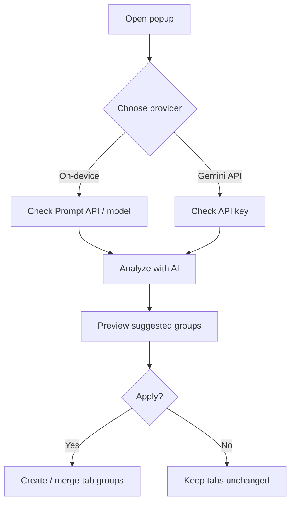

<div align="center">

# Tab Cluster AI

**Automatically group Chrome tabs with on-device AI or the Gemini API**

<p>
  
  
  
  <a href="LICENSE"></a>
  <a href="https://github.com/sponsors/0xmokuren"></a>
</p>

| English | 日本語 | Deutsch | Español | Français |
| :---: | :---: | :---: | :---: | :---: |
| **You are here** | [README.ja.md](README.ja.md) | [README.de.md](README.de.md) | [README.es.md](README.es.md) | [README.fr.md](README.fr.md) |

[Quick start](#quick-start) · [Install](#installation) · [Usage](#usage) · [FAQ](#faq) · [Development](#development)

<sub>An open alternative to Google's discontinued Tab Organizer — preview AI suggestions before applying.</sub>

</div>

---

## Table of contents

- [At a glance](#at-a-glance)
- [Features](#features)
- [How it works](#how-it-works)
- [Analysis modes](#analysis-modes)
- [Requirements](#requirements)
- [First-time model download](#first-time-model-download)
- [Quick start](#quick-start)
- [Installation](#installation)
- [Usage](#usage)
- [Limits](#limits)
- [Troubleshooting](#troubleshooting)
- [FAQ](#faq)
- [Development](#development)
- [Privacy](#privacy)
- [License](#license)

---

## At a glance

| | **On-device AI** | **Gemini API** |
| --- | --- | --- |
| **Best for** | Privacy-first, no API key | Faster setup, weaker hardware |
| **API key** | Not required | Required ([AI Studio](https://aistudio.google.com/apikey)) |
| **Data leaves device** | No (processed in Chrome) | Yes (titles + URLs to Google) |
| **22 GB model download** | Yes, on first analysis | No |
| **Chrome version** | 138+ with Prompt API | Any recent MV3 Chrome |
| **Tab limit per run** | 40 | 40 |

> **Tip:** Not sure which mode to use? Start with **Gemini API** if Prompt API shows `unavailable` in Diagnostics. Switch to on-device later for fully local processing.

---

## Features

| Feature | What you get |
| --- | --- |
| **On-device AI** | Semantic grouping via Gemini Nano (Prompt API). No API key, no cloud upload |
| **Gemini API** | Cloud analysis with a Google AI Studio key. Pick from several Gemini models |
| **Review before apply** | Every suggestion is shown in a preview — nothing changes until you confirm |
| **Domain fallback** | **Organize by domain** works without AI when you need a quick cleanup |
| **Merge with existing groups** | New suggestions can merge into tab groups you already have |
| **Custom preferences** | Optional free-text instructions (e.g. “separate work and shopping”) |
| **Diagnostics panel** | Hardware, Prompt API status, and likely blockers in one place |
| **Multilingual UI** | English, Japanese, German, Spanish, French — follows Chrome UI language |

> **Note:** Group **names** follow your browser/content language (`navigator.languages`). The **interface** follows Chrome's UI language (`chrome.i18n`). These are independent by design.

---

## How it works



1. Collect **ungrouped** `http://` / `https://` tabs (pinned tabs excluded).
2. Send tab **titles and URLs** to the chosen AI backend.
3. Parse the response into named, colored groups.
4. Optionally **match** proposals to existing groups on the same window.
5. You **apply** only when the preview looks right.

---

## Analysis modes

### On-device (Gemini Nano)

Uses Chrome's built-in [Prompt API](https://developer.chrome.com/docs/ai/prompt-api). Processing stays on your machine after the model is downloaded.

> **Warning:** Enabling **On-device AI** in Chrome settings does **not** install the model. The ~22 GB download starts when you run **Analyze with AI** for the first time.

### Gemini API

Calls Google's Generative Language API. Useful when Prompt API is blocked or hardware is below on-device thresholds.

> **Important:** Tab titles and URLs are transmitted to Google servers. Your API key is stored only in `chrome.storage.local` on this browser profile.

### Rule-based (no AI)

**Organize by domain** groups tabs sharing the same hostname. No model, no API key, no network — requires at least two tabs per domain.

---

## Requirements

### On-device AI

| Item | Requirement | Notes |
| --- | --- | --- |
| Browser | Chrome **138+** | Prompt API is not available on older builds |
| OS | macOS 13+ / Windows 10+ / Linux | Same as Chrome on-device AI support |
| Memory | **16 GB+** RAM (CPU) or **4 GB+** VRAM (GPU) | Values shown in Diagnostics are reference only |
| Storage | **22 GB+** free | For initial Gemini Nano download |
| Network | **Unmetered** (e.g. Wi‑Fi) | Required during first download |
| Chrome setting | **On-device AI** ON | Settings → System → On-device AI |

### Gemini API

| Item | Requirement | Notes |
| --- | --- | --- |
| Browser | Chrome with Manifest V3 | No minimum 138 for API mode alone |
| API key | [Google AI Studio](https://aistudio.google.com/apikey) | Free tier available; usage limits apply |
| Network | `generativelanguage.googleapis.com` | Blocked networks will fail with a connection error |

---

## First-time model download

Applies **only to on-device mode**.

| Phase | What happens | What you see |
| --- | --- | --- |
| **1. Trigger** | First **Analyze with AI** | “Checking AI readiness…” |
| **2. Download** | Chrome fetches ~22 GB | Percent + estimated bytes |
| **3. Background** | Chrome may DL before you analyze | Elapsed time indicator |
| **4. Load** | Model loaded into memory | “Loading model…” |
| **5. Ready** | Later runs use cache | No repeat download |

| Metric | Estimate |
| --- | --- |
| Size | **~22 GB** |
| Time | **Minutes to tens of minutes** |
| Network | Unmetered connection recommended |
| Disk | 22 GB+ free space |

> **Tip:** Keep the popup **open** during the first run so progress stays visible. Closing the popup stops the UI update; Chrome may still download in the background.

---

## Quick start

```
1. Load the extension (see Installation)
2. Click the Tab Cluster AI toolbar icon
3. Leave provider on "On-device" — or switch to "Gemini API" and paste a key
4. Open at least 2 ungrouped tabs in the target window
5. Click "Analyze with AI"
6. Review the preview → "Apply groups"
```

> **Shortcut:** Need instant grouping without AI? Use **Organize by domain** instead.

---

## Installation

### From GitHub Releases (recommended)

Each successful push to [`main`](https://github.com/0xmokuren/TabClusterAI/actions) publishes `TabClusterAI-{version}.zip` on [Releases](https://github.com/0xmokuren/TabClusterAI/releases).

| Step | Action |
| ---: | --- |
| 1 | Download the latest ZIP from [Releases](https://github.com/0xmokuren/TabClusterAI/releases/latest) |
| 2 | Extract to a folder (keep `manifest.json` at the top level) |
| 3 | Open `chrome://extensions` |
| 4 | Enable **Developer mode** (top right) |
| 5 | Click **Load unpacked** → select the extracted folder |

> **Note:** Not on Chrome Web Store yet. Developer mode is required. Bump `version` in `manifest.json` and push to `main` to publish a new release.

### Development (from repository)

```bash
git clone https://github.com/0xmokuren/TabClusterAI.git
cd TabClusterAI
npm install
npm run check    # validate + lint
npm run build    # dist/TabClusterAI-{version}.zip
```

Then **Load unpacked** from the repo root (or load the `dist/TabClusterAI` folder after `npm run build`).

---

## Usage

### Basic workflow

| Step | UI | Detail |
| ---: | --- | --- |
| 1 | Toolbar icon | Opens the popup |
| 2 | Provider switch | **On-device** (default) or **Gemini API** |
| 3 | Optional | Write grouping preferences (saved locally) |
| 4 | **Analyze with AI** | Needs ≥ 2 ungrouped tabs |
| 5 | Preview | Shows group names, colors, merge targets |
| 6 | **Apply groups** | Creates Chrome tab groups |

### Gemini API setup

| Step | Action |
| ---: | --- |
| 1 | Create a key at [Google AI Studio](https://aistudio.google.com/apikey) |
| 2 | Select **Gemini API** in the popup |
| 3 | Paste the key (auto-saved in this browser) |
| 4 | Choose a model (default: `gemini-3.1-flash-lite`) |

**Available models** (`lib/gemini-models.js`):

| Model ID | Display name | Tier | Notes |
| --- | --- | --- | --- |
| `gemini-3.1-flash-lite` | Gemini 3.1 Flash-Lite | stable | Default — fast, cost-efficient |
| `gemini-3.5-flash` | Gemini 3.5 Flash | stable | Newer stable flash |
| `gemini-2.5-flash-lite` | Gemini 2.5 Flash-Lite | stable | Previous-gen lite |
| `gemini-2.5-flash` | Gemini 2.5 Flash | stable | Previous-gen flash |
| `gemini-2.5-pro` | Gemini 2.5 Pro | stable | Higher quality, slower |
| `gemini-3-flash-preview` | Gemini 3 Flash | preview | Experimental; may change |

> **Note:** `stable` = production IDs. `preview` = early access. Deprecated models (2.0 series, etc.) may return **404** — switch model in settings.

> **Rate limits:** HTTP **429** means quota exceeded. Wait and retry, or check limits in AI Studio.

---

## Limits

| Limit | Value | Reason |
| --- | --- | --- |
| Tabs per analysis | **40** | Prompt / API payload size |
| Minimum tabs to group | **2** | Chrome tab groups need ≥ 2 tabs |
| Pinned tabs | Excluded | Intentional — pins stay untouched |
| `chrome://`, `file://`, etc. | Excluded | Only normal web URLs |
| Group name length | **20 chars** | Enforced in validation |

---

## Troubleshooting

| Symptom | Likely cause | What to try |
| --- | --- | --- |
| `unavailable` in status | RAM / disk / flags | Open **Diagnostics**, follow hints |
| Stuck at 0% download | Background DL | Wait; check `chrome://on-device-internals` |
| Empty preview | Too few groupable tabs | Add tabs or use **Organize by domain** |
| 403 / invalid key | Bad Gemini API key | Regenerate in AI Studio |
| 404 on API | Retired model ID | Pick a `stable` model in settings |
| Wrong UI language | Chrome UI locale | Change language at `chrome://settings/languages` |

**On-device checklist:**

1. `chrome://flags/#optimization-guide-on-device-model` → **Enabled**
2. `chrome://flags/#prompt-api-for-gemini-nano` → **Enabled multilingual**
3. `chrome://flags/#prompt-api-for-extension` → **Enabled** (if available)
4. `chrome://on-device-internals` → **Model Status** — no errors
5. Restart Chrome

---

## FAQ

<details>
<summary><strong>Does this replace Chrome's Tab Organizer?</strong></summary>

Google removed Tab Organizer from Chrome. Tab Cluster AI offers similar **semantic grouping** with a **preview step**, plus an optional **Gemini API** path and **domain-based** fallback.
</details>

<details>
<summary><strong>Why two language systems?</strong></summary>

- **UI language** — buttons, errors, diagnostics → Chrome UI language via `_locales/`
- **Group name language** — AI output → `navigator.languages` via `lib/locale.js`

Example: Chrome UI in English, group names in Japanese is supported.
</details>

<details>
<summary><strong>Is my API key safe?</strong></summary>

Stored in `chrome.storage.local` for this profile only. Never embedded in the repository. For Gemini API mode, tab metadata is still sent to Google's API — use on-device mode if that matters.
</details>

<details>
<summary><strong>Can I use it without any AI?</strong></summary>

Yes. **Organize by domain** clusters tabs by hostname without Prompt API or an API key.
</details>

---

## Development

```bash
npm install
npm run check           # manifest validate + locale key check + ESLint
npm run generate-icons  # PNGs from icons/icon.svg
npm run build           # dist/TabClusterAI-{version}.zip (includes _locales/)
```

### Project layout

```
TabClusterAI/
├── manifest.json          # MV3 entry, default_locale: en
├── _locales/              # UI strings (en, ja, de, es, fr)
│   └── */messages.json
├── background/
│   └── service_worker.js  # Minimal SW (tabs messaging)
├── lib/
│   ├── ai-organizer.js    # On-device Prompt API flow
│   ├── gemini-api-organizer.js
│   ├── locale.js          # AI output language / prompts
│   ├── i18n.js            # chrome.i18n wrapper
│   └── ...
├── popup/                 # HTML + CSS + JS UI
└── icons/
```

| Script | Purpose |
| --- | --- |
| `npm run validate` | Manifest, files, `_locales` key parity |
| `npm run lint` | ESLint 9 |
| `npm run build` | Stage + ZIP for Releases |

---

## Privacy

| Mode | What is processed | Where | Stored locally |
| --- | --- | --- | --- |
| **On-device** | Tab title + URL | Gemini Nano in Chrome | Preferences, optional API key N/A |
| **Gemini API** | Tab title + URL | Google Generative Language API | API key, grouping preferences |
| **By domain** | Tab URL hostname | Nowhere (rule-based) | Preferences only |

No analytics SDK. No remote config. Open source — inspect [`lib/`](lib/) and [`popup/`](popup/).

---

## License

[MIT License](LICENSE) — Copyright (c) 0xmokuren

---

<div align="center">

<sub>Tab Cluster AI v1.5.5 · <a href="https://github.com/0xmokuren/TabClusterAI/issues">Report an issue</a> · <a href="README.ja.md">日本語</a></sub>

</div>
